# Laporan Lengkap Exploratory Data Analysis

Laporan ini menyalin seluruh hasil tabel dan gambar dari `EDA/01.ipynb`, kemudian menjelaskan kegunaan serta arti setiap hasil.

Nama teknis `cutting_force` dipertahankan agar konsisten dengan notebook dan pipeline. Berdasarkan satuan kolom asli `Cutting Force (Nmm)`, variabel ini diinterpretasikan sebagai torsi pemotongan dalam N·mm.

# Exploratory Data Analysis

This notebook audits the dataset at both row and experiment levels. Experiment-level summaries prevent longer sequences from dominating the interpretation.

## Imports

## Data Loading

## Dataset Overview

Exact duplicate rows are reported descriptively. Identical measurements across different experiments are not automatically removed.

```text
Rows: 283,140
Columns: 6
Exact duplicate rows: 0
```

| index | dtype | missing | unique |
| --- | --- | --- | --- |
| density | int64 | 0 | 4 |
| cutting_speed | int64 | 0 | 6 |
| feed_rate | int64 | 0 | 3 |
| depth | float64 | 0 | 2640 |
| axial_force | float64 | 0 | 119488 |
| cutting_force | float64 | 0 | 182523 |

| index | count | mean | std | min | 25% | 50% | 75% | max |
| --- | --- | --- | --- | --- | --- | --- | --- | --- |
| density | 283140 | 16.8182 | 5.33971 | 10 | 10 | 15 | 20 | 25 |
| cutting_speed | 283140 | 42.3333 | 31.0842 | 10 | 16 | 32.5 | 63 | 100 |
| feed_rate | 283140 | 13.8462 | 3.99705 | 10 | 10 | 15 | 15 | 20 |
| depth | 283140 | 16.4885 | 9.52629 | 0 | 8.233 | 16.4915 | 24.733 | 32.983 |
| axial_force | 283140 | 61.3408 | 46.9843 | 0.067 | 23.335 | 44.753 | 87.7653 | 298.198 |
| cutting_force | 283140 | 165.363 | 208.96 | -2.163 | 31.8447 | 80.182 | 221.766 | 1392.34 |

**Kegunaan:** Memastikan ukuran data, tipe kolom, kelengkapan, duplikasi, dan rentang dasar sebelum analisis lanjutan.

**Arti hasil:** Dataset memiliki 283.140 baris dan enam kolom awal, tanpa missing value maupun duplikasi persis. Rentang cutting force lebar dan sangat condong ke kanan, sehingga mean saja tidak cukup untuk menggambarkan target.

## Experiment Identification

An experiment is identified within each machining condition whenever depth resets to zero. The resulting identifier is metadata and is never used as a model input.

## Experiment Integrity Audit

| check | count |
| --- | --- |
| experiments | 198 |
| invalid starts | 0 |
| non-increasing depth | 0 |
| too-short experiments | 0 |

| index | point_count |
| --- | --- |
| count | 198 |
| mean | 1430 |
| std | 412.626 |
| min | 990 |
| 25% | 990 |
| 50% | 1320 |
| 75% | 1980 |
| max | 1980 |

**Kegunaan:** Memastikan pemisahan sequence menjadi eksperimen tidak salah dan window nantinya tidak melintasi batas eksperimen.

**Arti hasil:** Terdapat 198 eksperimen. Semuanya dimulai dari depth nol, mempunyai depth yang meningkat, dan panjang minimal 990 titik. Identifikasi eksperimen dapat dipakai untuk split dan windowing.

## Experimental Coverage

```text
Machining conditions: 72
Experiments: 198
```

| density | cutting_speed | feed_rate | experiment_count | mean_points |
| --- | --- | --- | --- | --- |
| 10 | 10 | 10 | 3 | 1980 |
| 10 | 10 | 15 | 3 | 1320 |
| 10 | 10 | 20 | 3 | 990 |
| 10 | 16 | 10 | 3 | 1980 |
| 10 | 16 | 15 | 3 | 1320 |
| 10 | 16 | 20 | 3 | 990 |
| 10 | 25 | 10 | 3 | 1980 |
| 10 | 25 | 15 | 3 | 1320 |
| 10 | 25 | 20 | 3 | 990 |
| 10 | 40 | 10 | 3 | 1980 |
| 10 | 40 | 15 | 3 | 1320 |
| 10 | 40 | 20 | 3 | 990 |
| 10 | 63 | 10 | 3 | 1980 |
| 10 | 63 | 15 | 3 | 1320 |
| 10 | 63 | 20 | 3 | 990 |
| 10 | 100 | 10 | 3 | 1980 |
| 10 | 100 | 15 | 3 | 1320 |
| 10 | 100 | 20 | 3 | 990 |
| 15 | 10 | 10 | 3 | 1980 |
| 15 | 10 | 15 | 3 | 1320 |
| 15 | 10 | 20 | 3 | 990 |
| 15 | 16 | 10 | 3 | 1980 |
| 15 | 16 | 15 | 3 | 1320 |
| 15 | 16 | 20 | 3 | 990 |
| 15 | 25 | 10 | 3 | 1980 |
| 15 | 25 | 15 | 3 | 1320 |
| 15 | 25 | 20 | 3 | 990 |
| 15 | 40 | 10 | 3 | 1980 |
| 15 | 40 | 15 | 3 | 1320 |
| 15 | 40 | 20 | 3 | 990 |
| 15 | 63 | 10 | 3 | 1980 |
| 15 | 63 | 15 | 3 | 1320 |
| 15 | 63 | 20 | 3 | 990 |
| 15 | 100 | 10 | 3 | 1980 |
| 15 | 100 | 15 | 3 | 1320 |
| 15 | 100 | 20 | 3 | 990 |
| 20 | 10 | 10 | 3 | 1980 |
| 20 | 10 | 15 | 3 | 1320 |
| 20 | 10 | 20 | 3 | 990 |
| 20 | 16 | 10 | 3 | 1980 |
| 20 | 16 | 15 | 3 | 1320 |
| 20 | 16 | 20 | 3 | 990 |
| 20 | 25 | 10 | 3 | 1980 |
| 20 | 25 | 15 | 3 | 1320 |
| 20 | 25 | 20 | 3 | 990 |
| 20 | 40 | 10 | 3 | 1980 |
| 20 | 40 | 15 | 3 | 1320 |
| 20 | 40 | 20 | 3 | 990 |
| 20 | 63 | 10 | 3 | 1980 |
| 20 | 63 | 15 | 3 | 1320 |
| 20 | 63 | 20 | 3 | 990 |
| 20 | 100 | 10 | 3 | 1980 |
| 20 | 100 | 15 | 3 | 1320 |
| 20 | 100 | 20 | 3 | 990 |
| 25 | 10 | 10 | 2 | 1980 |
| 25 | 10 | 15 | 2 | 1320 |
| 25 | 10 | 20 | 2 | 990 |
| 25 | 16 | 10 | 2 | 1980 |
| 25 | 16 | 15 | 2 | 1320 |
| 25 | 16 | 20 | 2 | 990 |
| 25 | 25 | 10 | 2 | 1980 |
| 25 | 25 | 15 | 2 | 1320 |
| 25 | 25 | 20 | 2 | 990 |
| 25 | 40 | 10 | 2 | 1980 |
| 25 | 40 | 15 | 2 | 1320 |
| 25 | 40 | 20 | 2 | 990 |
| 25 | 63 | 10 | 2 | 1980 |
| 25 | 63 | 15 | 2 | 1320 |
| 25 | 63 | 20 | 2 | 990 |
| 25 | 100 | 10 | 2 | 1980 |
| 25 | 100 | 15 | 2 | 1320 |
| 25 | 100 | 20 | 2 | 990 |

| experiment_count | condition_count |
| --- | --- |
| 2 | 18 |
| 3 | 54 |

**Kegunaan:** Memeriksa kelengkapan desain eksperimen dan jumlah replikasi pada setiap kondisi pemesinan.

**Arti hasil:** Seluruh 72 kombinasi kondisi tersedia. Sebanyak 54 kondisi mempunyai tiga eksperimen dan 18 kondisi mempunyai dua eksperimen. Dua replikasi minimum mendukung Stratified 2-Fold pada level eksperimen.

## Machining Parameter Distribution

The machining parameters are discrete experimental factors, so their coverage is shown with counts rather than continuous boxplots.

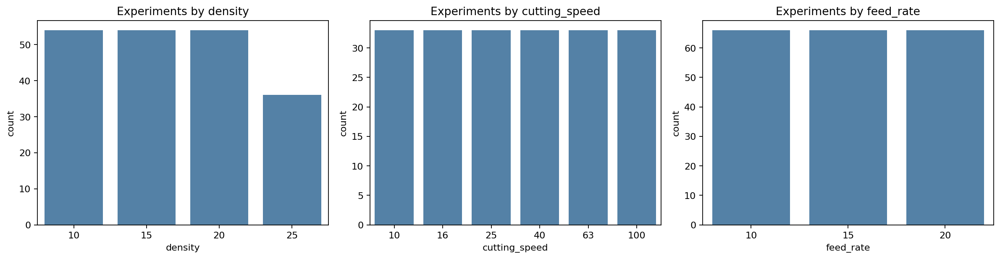

**Kegunaan:** Menunjukkan keseimbangan jumlah eksperimen pada setiap level density, cutting speed, dan feed rate.

**Arti hasil:** Distribusi level parameter lengkap. Perbedaan jumlah terutama berasal dari density 25 yang memiliki dua replikasi, sedangkan level density lain umumnya memiliki tiga replikasi.

## Continuous Measurements

These row-level plots describe measurement ranges. They are not used to compare condition frequencies because experiments have different sequence lengths.

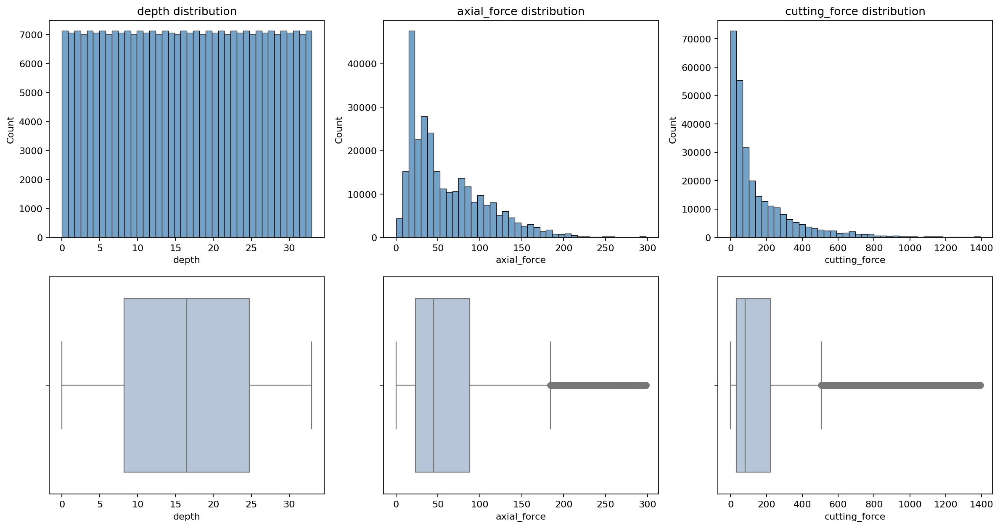

**Kegunaan:** Menampilkan rentang, kemencengan, dan nilai ekstrem pengukuran kontinu pada level baris.

**Arti hasil:** Depth tersebar hampir seragam sepanjang proses. Axial force dan cutting force condong ke kanan dengan beberapa nilai tinggi yang perlu ditinjau pada level eksperimen, bukan langsung dibuang.

## Experiment-Balanced Summary

Each experiment contributes one summary row, preventing experiments with more sampled points from receiving more weight.

| index | count | mean | std | min | 25% | 50% | 75% | max |
| --- | --- | --- | --- | --- | --- | --- | --- | --- |
| density | 198 | 16.8182 | 5.35324 | 10 | 10 | 15 | 20 | 25 |
| cutting_speed | 198 | 42.3333 | 31.1629 | 10 | 16 | 32.5 | 63 | 100 |
| feed_rate | 198 | 15 | 4.09283 | 10 | 10 | 15 | 20 | 20 |
| experiment_id | 198 | 1.90909 | 0.794536 | 1 | 1 | 2 | 3 | 3 |
| point_count | 198 | 1430 | 412.626 | 990 | 990 | 1320 | 1980 | 1980 |
| depth_max | 198 | 32.975 | 0.00654853 | 32.967 | 32.967 | 32.975 | 32.983 | 32.983 |
| axial_force_mean | 198 | 62.9413 | 45.7785 | 11.8941 | 23.9973 | 49.0387 | 91.4219 | 222.207 |
| axial_force_std | 198 | 13.1161 | 10.0549 | 2.22524 | 4.8999 | 10.7529 | 18.9166 | 57.8022 |
| cutting_force_mean | 198 | 169.751 | 153.65 | 15.1069 | 48.2572 | 124.849 | 252.352 | 674.826 |
| cutting_force_std | 198 | 109.36 | 100.572 | 7.58783 | 30.1101 | 80.3522 | 159.67 | 433.805 |
| cutting_force_max | 198 | 354.383 | 326.218 | 27.663 | 100.009 | 257.387 | 510.191 | 1392.34 |

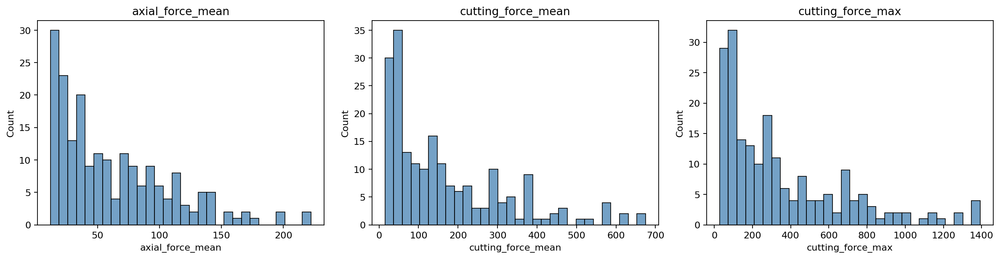

**Kegunaan:** Memberi bobot satu kali untuk setiap eksperimen sehingga sequence yang lebih panjang tidak mendominasi statistik.

**Arti hasil:** Panjang eksperimen adalah 990, 1.320, atau 1.980 titik. Variasi mean dan maksimum force antareksperimen besar, sehingga evaluasi model perlu dilengkapi metrik per eksperimen.

## Sampling Interval Audit

| feed_rate | count | mean | std | min | max |
| --- | --- | --- | --- | --- | --- |
| 10 | 66 | 0.017 | 0 | 0.017 | 0.017 |
| 15 | 66 | 0.025 | 0 | 0.025 | 0.025 |
| 20 | 66 | 0.033 | 0 | 0.033 | 0.033 |

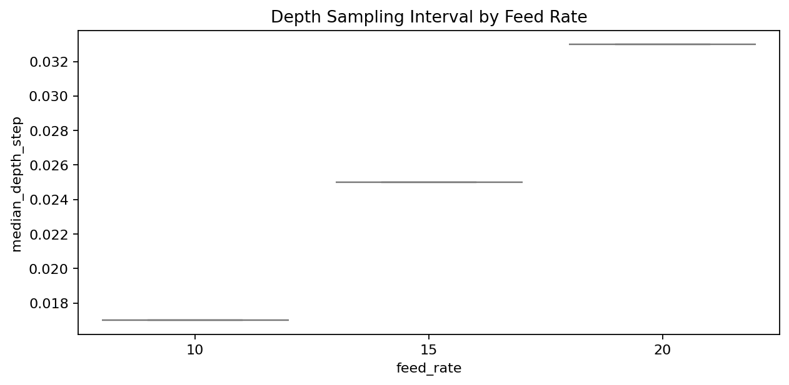

**Kegunaan:** Memeriksa apakah interval depth dan panjang sequence berubah mengikuti feed rate.

**Arti hasil:** Median interval depth tepat 0,017 untuk feed rate 10, 0,025 untuk feed rate 15, dan 0,033 untuk feed rate 20. Statistik berbasis baris akan memberi bobot lebih besar pada feed rate 10.

## Experiment-Level Relationships

Correlations are calculated from one row per experiment. They remain descriptive and do not establish causality.

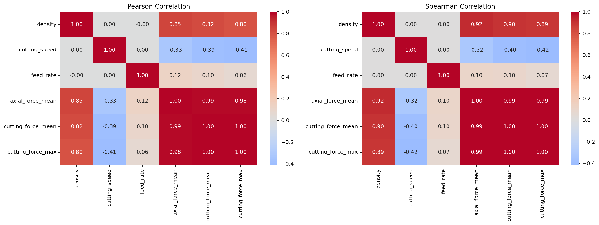

**Kegunaan:** Membandingkan hubungan linear dan hubungan monotonic antarfaktor serta respons pada level eksperimen.

**Arti hasil:** Pearson dan Spearman membantu membedakan hubungan linear dari pola monotonic. Korelasi bersifat deskriptif dan tidak membuktikan sebab-akibat atau menggantikan analisis interaction effect.

## Replicate Variability

| index | density | cutting_speed | feed_rate | experiment_count | cutting_force_mean | cutting_force_between_replicate_std | axial_force_mean | axial_force_between_replicate_std |
| --- | --- | --- | --- | --- | --- | --- | --- | --- |
| 36 | 20 | 10 | 10 | 3 | 310.234 | 23.5112 | 110.661 | 3.05097 |
| 58 | 25 | 16 | 15 | 2 | 522.384 | 17.0576 | 155.99 | 3.26516 |
| 64 | 25 | 40 | 15 | 2 | 349.901 | 12.0295 | 108.446 | 0.956001 |
| 69 | 25 | 100 | 10 | 2 | 146.178 | 10.7099 | 54.4271 | 3.07332 |
| 43 | 20 | 25 | 15 | 3 | 261.803 | 10.7067 | 87.2182 | 3.98464 |
| 60 | 25 | 25 | 10 | 2 | 379.816 | 10.0797 | 114.742 | 1.24087 |
| 54 | 25 | 10 | 10 | 2 | 573.195 | 9.86063 | 165.749 | 0.624286 |
| 40 | 20 | 16 | 15 | 3 | 315.577 | 8.51345 | 110.826 | 1.41682 |
| 70 | 25 | 100 | 15 | 2 | 170.872 | 7.96256 | 62.7947 | 1.57015 |
| 47 | 20 | 40 | 20 | 3 | 226.947 | 7.94276 | 90.1684 | 5.41869 |

**Kegunaan:** Mengidentifikasi kondisi dengan variasi mean force terbesar antar-replikasi.

**Arti hasil:** Beberapa kondisi memiliki perbedaan replikasi yang jauh lebih besar daripada kondisi lain. Variasi ini merupakan bagian dari noise proses dan menjadi batas realistis performa prediksi.

## Sequence Example Across Replicates

All replicates from one machining condition are shown together to reveal within-condition variability.

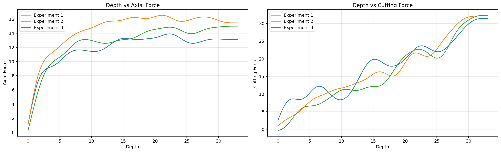

**Kegunaan:** Membandingkan bentuk sequence seluruh replikasi pada satu kondisi yang sama.

**Arti hasil:** Replikasi mengikuti pola depth yang serupa tetapi tidak identik. Model perlu mempelajari pola umum tanpa menghafal satu replikasi.

## Detailed Data Quality

Finite values, physical signs, skewness, and extreme quantiles are reviewed without automatically deleting unusual measurements.

| index | finite | negative_count | zero_count | skewness |
| --- | --- | --- | --- | --- |
| density | True | 0 | 0 | 0.133241 |
| cutting_speed | True | 0 | 0 | 0.795268 |
| feed_rate | True | 0 | 0 | 0.438361 |
| depth | True | 0 | 198 | 2.98212e-10 |
| axial_force | True | 0 | 0 | 1.24644 |
| cutting_force | True | 363 | 0 | 2.37688 |

| index | 0.001 | 0.01 | 0.05 | 0.5 | 0.95 | 0.99 | 0.999 |
| --- | --- | --- | --- | --- | --- | --- | --- |
| density | 10 | 10 | 10 | 15 | 25 | 25 | 25 |
| cutting_speed | 10 | 10 | 10 | 32.5 | 100 | 100 | 100 |
| feed_rate | 10 | 10 | 10 | 15 | 20 | 20 | 20 |
| depth | 0.025 | 0.317 | 1.633 | 16.4915 | 31.333 | 32.667 | 32.95 |
| axial_force | 1.76214 | 5.61939 | 13.7119 | 44.753 | 153.728 | 204.101 | 290.844 |
| cutting_force | -0.160861 | 2.83339 | 9.451 | 80.182 | 610.372 | 1009.19 | 1358.34 |

**Kegunaan:** Mengaudit nilai tidak finite, nilai negatif, nilai nol, skewness, dan quantile ekstrem.

**Arti hasil:** Semua nilai finite. Cutting force memiliki 363 nilai negatif kecil dan skewness tinggi; nilai tersebut perlu dipertahankan kecuali ada bukti kesalahan sensor. Quantile menunjukkan ekor kanan target yang panjang.

## Factorial Design Coverage

Every density, cutting-speed, and feed-rate combination is checked. Cell values are independent experiment counts.

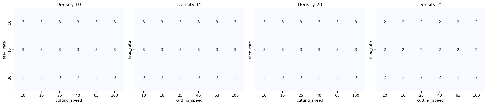

**Kegunaan:** Memastikan tidak ada sel kombinasi density, cutting speed, dan feed rate yang hilang.

**Arti hasil:** Keempat panel density berisi seluruh kombinasi cutting speed dan feed rate. Nilai sel dua atau tiga menunjukkan jumlah replikasi, bukan jumlah baris.

## Target Response by Machining Factor

Each observation is an experiment mean, ensuring equal weight across experiments.

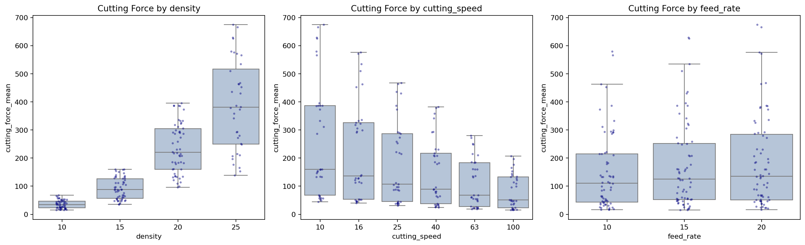

**Kegunaan:** Menilai perubahan cutting force terhadap masing-masing faktor dengan bobot yang sama per eksperimen.

**Arti hasil:** Sebaran respons berubah antarlevel parameter dan menunjukkan variasi dalam level yang sama. Karena faktor saling berinteraksi, plot marginal harus dibaca bersama heatmap interaksi.

## Parameter Interaction Effects

Heatmap memberikan indikasi deskriptif interaksi cutting speed dan feed rate pada setiap density; visualisasi ini bukan pengujian interaksi formal.

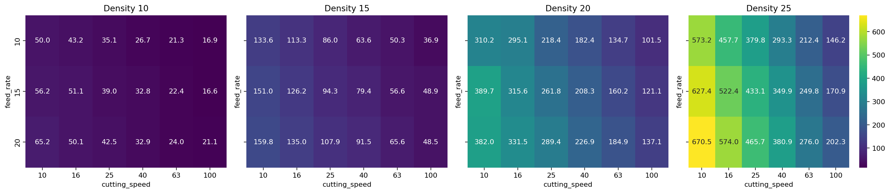

**Kegunaan:** Menunjukkan bagaimana pengaruh cutting speed dan feed rate berubah pada density yang berbeda.

**Arti hasil:** Perbedaan pola antarpanel mengindikasikan kemungkinan interaksi antarfaktor dan mendukung pengujian seluruh parameter sebagai fitur model. Pembuktian interaction effect memerlukan analisis statistik tambahan.

## Axial Force and Cutting Torque Relationship

A reproducible row sample shows local association, while experiment means show between-experiment association.

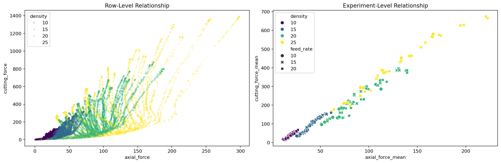

**Kegunaan:** Membandingkan hubungan axial force dan torsi pemotongan pada level titik serta level eksperimen.

**Arti hasil:** Keduanya mempunyai asosiasi kuat, tetapi penyebaran tetap terlihat. Axial force berpotensi menjadi fitur prediktif tinggi, dengan syarat tersedia pada waktu prediksi.

## Depth-Dependent Force and Torque Profiles

Relative depth and experiment-level bins make profiles comparable despite different sampling intervals.

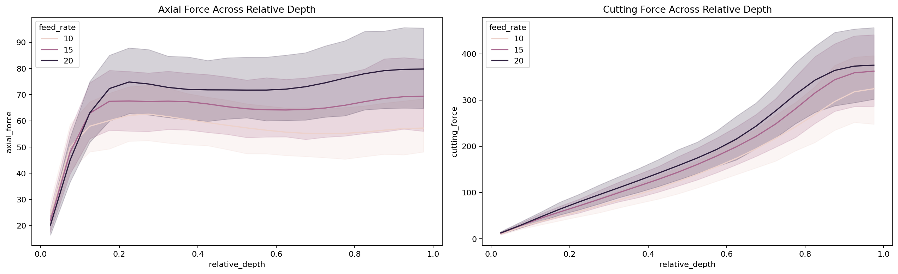

**Kegunaan:** Membandingkan perkembangan force sepanjang proses setelah depth dinormalisasi menjadi progres relatif.

**Arti hasil:** Force berubah secara sistematis terhadap depth dan berbeda menurut feed rate. Informasi urutan penting dan tidak cukup direpresentasikan oleh ringkasan statis.

## Replicate Profile Similarity

Replicates are aligned by depth. Correlation measures profile-shape agreement and RMSE measures absolute disagreement.

| index | count | mean | std | min | 25% | 50% | 75% | max |
| --- | --- | --- | --- | --- | --- | --- | --- | --- |
| correlation | 180 | 0.996122 | 0.00899104 | 0.949067 | 0.997892 | 0.999555 | 0.999862 | 0.999993 |
| rmse | 180 | 6.8621 | 6.16898 | 0.782797 | 3.62271 | 4.96839 | 7.75699 | 56.1015 |
| aligned_points | 180 | 1430 | 412.73 | 990 | 990 | 1320 | 1980 | 1980 |

| index | density | cutting_speed | feed_rate | left_experiment | right_experiment | aligned_points | correlation | rmse |
| --- | --- | --- | --- | --- | --- | --- | --- | --- |
| 37 | 20 | 10 | 10 | 1 | 3 | 1980 | 0.999661 | 56.1015 |
| 36 | 20 | 10 | 10 | 1 | 2 | 1980 | 0.999668 | 30.3648 |
| 38 | 20 | 10 | 10 | 2 | 3 | 1980 | 0.999944 | 26.0662 |
| 79 | 25 | 16 | 15 | 1 | 2 | 1320 | 0.999867 | 25.4884 |
| 107 | 20 | 25 | 15 | 1 | 3 | 1320 | 0.999892 | 23.4157 |
| 139 | 25 | 40 | 15 | 1 | 2 | 1320 | 0.999865 | 22.104 |
| 108 | 20 | 25 | 15 | 2 | 3 | 1320 | 0.999861 | 17.5414 |
| 147 | 20 | 40 | 20 | 1 | 3 | 990 | 0.999938 | 17.4676 |
| 77 | 20 | 16 | 15 | 1 | 3 | 1320 | 0.999782 | 17.257 |
| 39 | 25 | 10 | 10 | 1 | 2 | 1980 | 0.999929 | 17.0754 |

**Kegunaan:** Mengukur kesamaan bentuk dan perbedaan absolut antarreplikasi pada kondisi yang sama.

**Arti hasil:** Rata-rata korelasi profil sekitar 0,996, tetapi RMSE antar-replikasi rata-rata sekitar 6,86 dan maksimum sekitar 56,10. Korelasi tinggi tidak berarti nilai absolut identik.

## Sequence Autocorrelation

Autocorrelation mengukur redundansi berurutan sepanjang depth dan membantu menentukan window serta stride.

| lag | mean | std | min | max |
| --- | --- | --- | --- | --- |
| 1 | 0.999999 | 7.4613e-07 | 0.999995 | 1 |
| 5 | 0.999977 | 1.87334e-05 | 0.999865 | 0.999996 |
| 10 | 0.999907 | 7.52846e-05 | 0.999456 | 0.999984 |
| 25 | 0.999426 | 0.000474061 | 0.996518 | 0.999901 |
| 50 | 0.997772 | 0.00187785 | 0.985831 | 0.999615 |
| 100 | 0.992195 | 0.00680161 | 0.94676 | 0.998683 |

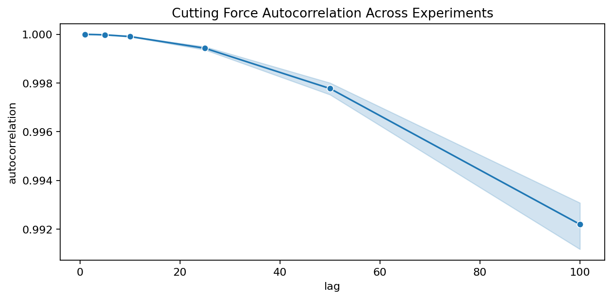

**Kegunaan:** Mengukur ketergantungan cutting force terhadap nilai sebelumnya untuk menilai karakter sequence dan overlap window.

**Arti hasil:** Autocorrelation sangat tinggi bahkan sampai lag 100. Temuan ini memberi alasan untuk menguji sequence model, bukan membuktikan bahwa sequence model pasti lebih unggul. Overlapping window sangat berkorelasi dan tidak boleh dianggap sebagai sampel independen.

## Within-Condition Replicate Review

Eksperimen dibandingkan hanya dengan replikasi pada kondisi pemesinan yang sama menggunakan deviasi absolut dan relatif terhadap median kondisi.

**Kegunaan:** Memprioritaskan replikasi dengan perbedaan terbesar untuk inspeksi kurva tanpa mencampurkan efek kondisi pemesinan dengan anomali data.

**Arti hasil:** Karena setiap kondisi hanya memiliki dua atau tiga replikasi, deviasi besar diperlakukan sebagai prioritas pemeriksaan, bukan bukti formal bahwa suatu eksperimen adalah outlier. Tidak ada data yang otomatis dihapus.

## Stratified Split Readiness

The 2-fold strategy is audited at experiment level for overlap, condition coverage, and exactly one test appearance per experiment.

| fold | train_experiments | test_experiments | overlap | train_conditions | test_conditions | test_conditions_missing_from_train |
| --- | --- | --- | --- | --- | --- | --- |
| 1 | 99 | 99 | 0 | 72 | 72 | 0 |
| 2 | 99 | 99 | 0 | 72 | 72 | 0 |

**Kegunaan:** Membuktikan bahwa Stratified 2-Fold memenuhi pemisahan eksperimen dan cakupan kondisi.

**Arti hasil:** Setiap fold memiliki 99 train dan 99 test experiments, tanpa overlap. Seluruh 72 kondisi muncul di train dan test, serta setiap eksperimen menjadi test tepat sekali.

# Panduan Interpretasi Mendalam

## 1. Cara memahami struktur dataset

Dataset ini tidak boleh dianggap sebagai 283.140 sampel yang sepenuhnya independen. Baris-baris yang berdekatan berasal dari eksperimen dan proses pemotongan yang sama, sehingga nilainya sangat saling berkaitan. Unit observasi independen yang lebih tepat adalah **eksperimen**, dengan total 198 eksperimen.

Setiap eksperimen mempunyai kombinasi `density`, `cutting_speed`, dan `feed_rate`, kemudian berisi urutan pengukuran berdasarkan `depth`. `axial_force` menjadi fitur dinamis dan `cutting_force` menjadi target. Karena bentuknya sequence, urutan baris tidak boleh diacak sebelum window dibentuk.

Tidak adanya missing value dan duplikasi persis berarti data tidak membutuhkan imputasi atau penghapusan duplikat. Namun, ini belum otomatis berarti seluruh pengukuran sempurna. Nilai ekstrem dan nilai cutting force negatif tetap perlu dipahami berdasarkan proses fisik dan karakteristik sensor.

## 2. Cara memahami eksperimen dan replikasi

Terdapat 72 kombinasi kondisi yang berasal dari:

- 4 level density.
- 6 level cutting speed.
- 3 level feed rate.

Perhitungannya adalah `4 × 6 × 3 = 72`. Setiap kondisi mempunyai dua atau tiga replikasi, sehingga totalnya menjadi 198 eksperimen. Replikasi adalah pengulangan proses pada kondisi parameter yang sama.

Replikasi penting karena dua proses dengan parameter identik tidak selalu menghasilkan kurva force yang identik. Perbedaannya dapat berasal dari noise sensor, variasi material, kondisi alat, atau variasi proses lainnya. Oleh karena itu, model seharusnya mempelajari pola umum suatu kondisi, bukan menghafal satu eksperimen tertentu.

## 3. Mengapa statistik per baris dapat menyesatkan

Feed rate memengaruhi interval pengambilan sampel:

| Feed rate | Median interval depth | Titik per eksperimen |
|---:|---:|---:|
| 10 | 0,017 | 1.980 |
| 15 | 0,025 | 1.320 |
| 20 | 0,033 | 990 |

Eksperimen feed rate 10 memiliki dua kali lebih banyak baris daripada feed rate 20. Jika mean, korelasi, atau loss dihitung langsung dari seluruh baris, feed rate 10 otomatis memperoleh bobot sekitar dua kali lebih besar.

Karena itu laporan menyediakan dua sudut pandang:

- **Row-level** untuk memahami rentang dan perilaku sinyal secara detail.
- **Experiment-level** untuk membandingkan eksperimen dengan bobot yang sama.

Untuk menyimpulkan performa umum model, experiment-level metric lebih adil. Row-level metric tetap berguna untuk menunjukkan akurasi pada setiap titik pengukuran.

## 4. Cara membaca histogram dan boxplot

Histogram menunjukkan seberapa sering suatu rentang nilai muncul. Batang tinggi berarti banyak observasi berada pada rentang tersebut. Boxplot merangkum median, 50% data tengah, dan nilai yang jauh dari distribusi utama.

Distribusi axial force dan cutting force condong ke kanan. Artinya, sebagian besar pengukuran berada pada nilai rendah hingga menengah, tetapi terdapat sebagian kecil nilai yang sangat tinggi. Kondisi ini menyebabkan RMSE sensitif terhadap eksperimen sulit karena error besar dikuadratkan.

MAE dan RMSE perlu dilaporkan bersama:

- **MAE** mudah dipahami sebagai rata-rata besar kesalahan.
- **RMSE** memberi penalti lebih besar pada prediksi yang meleset jauh.

Jika RMSE jauh lebih besar daripada MAE, biasanya terdapat beberapa eksperimen atau bagian sequence dengan error ekstrem.

## 5. Cara membaca korelasi

Korelasi berada pada rentang -1 sampai 1:

- Mendekati 1 berarti dua variabel cenderung meningkat bersama.
- Mendekati -1 berarti satu variabel meningkat ketika variabel lain menurun.
- Mendekati 0 berarti tidak ada hubungan sederhana yang kuat.

Pearson mengukur hubungan linear, sedangkan Spearman mengukur hubungan berdasarkan urutan atau pola monotonic. Perbedaan keduanya dapat menunjukkan hubungan yang konsisten tetapi tidak sepenuhnya linear.

Korelasi tidak membuktikan sebab-akibat. Contohnya, axial force dan cutting force dapat memiliki korelasi tinggi karena keduanya dipengaruhi oleh kondisi pemotongan yang sama. Axial force tetap layak menjadi fitur prediksi hanya jika tersedia saat model digunakan.

## 6. Cara membaca pengaruh dan interaksi parameter

Boxplot per parameter memperlihatkan marginal effect, yaitu perubahan target ketika satu parameter dilihat secara terpisah. Akan tetapi, proses pemotongan dapat memiliki interaction effect: pengaruh feed rate mungkin berbeda pada density atau cutting speed tertentu.

Heatmap interaksi perlu dibaca sebagai berikut:

- Setiap panel mewakili satu density.
- Baris mewakili feed rate.
- Kolom mewakili cutting speed.
- Warna dan angka menunjukkan mean cutting force.

Jika pola warna berbeda antar-panel, pengaruh cutting speed dan feed rate bergantung pada density. Ini mendukung penggunaan seluruh parameter secara bersamaan di dalam model.

## 7. Cara memahami depth profile dan autocorrelation

Relative depth mengubah posisi proses menjadi skala 0 sampai 1:

- 0 berarti awal eksperimen.
- 0,5 berarti pertengahan.
- 1 berarti akhir eksperimen.

Normalisasi ini membuat sequence dengan jumlah titik berbeda dapat dibandingkan. Perubahan respons sepanjang relative depth menunjukkan bahwa posisi berurutan berdasarkan depth membawa informasi penting.

Autocorrelation torsi pemotongan tetap di atas sekitar 0,99 sampai lag 100. Artinya, nilai yang berdekatan sangat mirip. Temuan ini mendukung pengujian LSTM, GRU, RNN, dan TCN, tetapi keunggulannya tetap harus dibuktikan melalui evaluasi terhadap baseline yang sesuai.

Namun, autocorrelation yang sangat tinggi juga berarti overlapping window tidak independen. Ribuan window tidak setara dengan ribuan eksperimen baru. Karena itu train-test split harus dilakukan sebelum windowing dan berdasarkan eksperimen.

## 8. Cara memahami variasi antar-replikasi

Rata-rata correlation kurva antarreplikasi sekitar 0,996. Ini menunjukkan bentuk kurvanya sangat mirip. Walaupun demikian, RMSE antarreplikasi rata-rata sekitar 6,86 dan dapat mencapai sekitar 56,10.

Dua kurva bisa memiliki correlation hampir sempurna tetapi RMSE besar apabila bentuknya sama dan salah satunya bergeser ke atas. Oleh karena itu:

- Correlation menilai kemiripan bentuk.
- RMSE menilai perbedaan nilai absolut.

Perbedaan antarreplikasi merupakan benchmark empiris variasi proses, bukan batas minimum error model yang formal. Variasi ini membantu memberi konteks ketika menilai besar error prediksi.

## 9. Cara memahami pemeriksaan replikasi

Perbandingan global dapat salah menandai seluruh kondisi dengan respons tinggi sebagai outlier. Karena itu setiap eksperimen dibandingkan dengan replikasi pada kombinasi density, cutting speed, dan feed rate yang sama. Langkah pemeriksaannya adalah:

1. Periksa kurva terhadap depth.
2. Bandingkan dengan replikasi pada kondisi yang sama.
3. Periksa kemungkinan gangguan sensor atau pencatatan.
4. Pertahankan eksperimen jika masih masuk akal secara fisik.

Jumlah replikasi yang hanya dua atau tiga belum cukup untuk menetapkan outlier secara formal. Menghapus eksperimen hanya karena deviasinya besar atau sulit diprediksi dapat membuat hasil model terlihat lebih baik secara tidak jujur.

## 10. Cara memahami audit split

Stratified 2-Fold membagi 198 eksperimen menjadi:

| Fold | Training experiments | Test experiments | Overlap |
|---:|---:|---:|---:|
| 1 | 99 | 99 | 0 |
| 2 | 99 | 99 | 0 |

Seluruh 72 kondisi muncul pada training dan test di setiap fold. Jadi pengujian ini menjawab pertanyaan:

> Seberapa baik model memprediksi replikasi baru dari kondisi pemesinan yang sudah dikenal?

Pengujian ini belum menjawab kemampuan model memprediksi kombinasi parameter yang sama sekali tidak pernah dilihat. Untuk tujuan tersebut diperlukan evaluasi tambahan berupa group split berdasarkan kombinasi kondisi.

Setiap eksperimen menjadi test tepat satu kali dan tidak ada eksperimen yang muncul bersamaan pada training dan test. Ini mencegah window dari eksperimen yang sama bocor ke kedua sisi.

## 11. Implikasi langsung untuk modeling

Berdasarkan seluruh hasil EDA, pipeline modeling seharusnya memenuhi ketentuan berikut:

1. Split dilakukan pada level eksperimen sebelum windowing.
2. Scaler hanya di-fit pada training fold.
3. `experiment_id` tidak digunakan sebagai fitur.
4. Inner validation hanya digunakan untuk memilih best epoch.
5. Model final dilatih ulang pada seluruh outer-training.
6. Outer-test hanya digunakan untuk evaluasi terakhir.
7. MAE dan RMSE dilaporkan pada level global dan per eksperimen.
8. Eksperimen sulit tetap dipertahankan dan dilaporkan melalui tabel worst experiments.
9. Perbedaan interval sampling antar-feed-rate harus dipertimbangkan saat menentukan window dan stride.
10. Ketersediaan axial force saat deployment harus dijelaskan secara eksplisit.

Dengan ketentuan tersebut, hasil model dapat diinterpretasikan sebagai evaluasi replikasi baru yang bebas dari leakage antareksperimen dan lebih adil terhadap seluruh kondisi pemesinan.

## Batas Ketersediaan Fitur dan Leakage

`experiment_id` hanya merupakan metadata dan tidak boleh masuk ke tensor model. Scaling, pemilihan epoch, serta preprocessing yang mempelajari parameter dari data harus di-fit menggunakan training data saja. `axial_force` hanya sah digunakan sebagai input jika pengukurannya tersedia saat prediksi dilakukan; jika tidak, perlu dilakukan ablation tanpa fitur tersebut.
